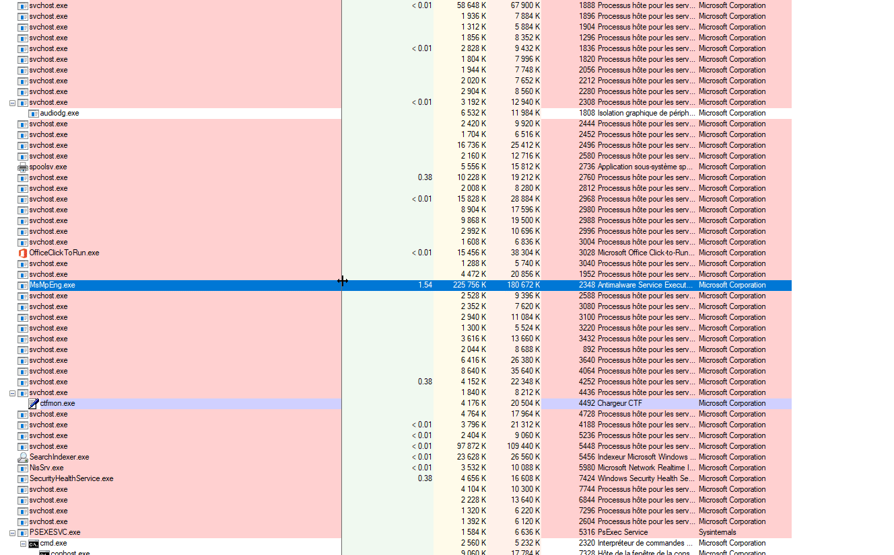

# NerfToken - GolangEdition

```
    _   _            __ _______    _                 
   | \ | |          / _|__   __|  | |                  
   |  \| | ___ _ __| |_   | | ___ | | _____ _ __                  
   | . ` |/ _ \ '__|  _|  | |/ _ \| |/ / _ \ '_ \                     
   | |\  |  __/ |  | |    | | (_) |   <  __/ | | |                  
   |_|_\_|\___|_|_ |_|    |_|\___/|_|\_\___|_| |_| _ _   _                      
    / ____|     | |                   |  ____|  | (_) | (_)                
   | |  __  ___ | | __ _ _ __   __ _  | |__   __| |_| |_ _  ___  _ __  
   | | |_ |/ _ \| |/ _` | '_ \ / _` | |  __| / _` | | __| |/ _ \| '_ \  
   | |__| | (_) | | (_| | | | | (_| | | |___| (_| | | |_| | (_) | | | | 
    \_____|\___/|_|\__,_|_| |_|\__, | |______\__,_|_|\__|_|\___/|_| |_|
                                __/ |                 
                               |___/                 
```

Quick and dirty POC of the recently discovered AV bypass technique Nerftoken in Golang.

* Tested on Windows 10 x64
* Need SYSTEM shell in order to change Defender's tokens


### Credits to Gabriel Landau (@gabriellandau) for his research.

**Paper:** https://elastic.github.io/security-research/whitepapers/2022/02/02.sandboxing-antimalware-products-for-fun-and-profit/article/


